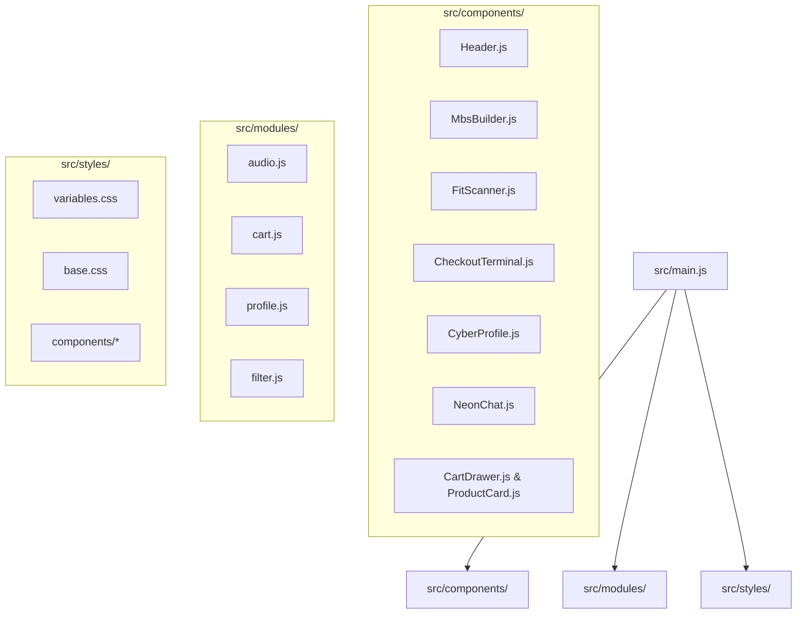

# 🌐 Techwear OS // Project Architecture & Roadmap

**Techwear OS (v1.8)** — это экспериментальный PWA-магазин технологичной экипировки и кибернетических модулей. Проект выполнен в стиле militaristic-cyberpunk с темным интерфейсом, неоновой графикой, сложным звуковым сопровождением и интерактивными терминалами.

---

## 📂 Архитектура проекта



---

## 🚀 Выполненные этапы (Milestones)

### 🎨 Milestone 1: База и Дизайн-Система
- [x] Развернуть сборщик Vite, очистить дефолтный код
- [x] Спроектировать дизайн-токены в [variables.css](file:///home/lelyaler/Antigravity%20code/techwear/src/styles/variables.css) (неоновые свечения, тактические цвета, Orbitron/Inter шрифты)
- [x] Создать базовую тактическую разметку в [index.html](file:///home/lelyaler/Antigravity%20code/techwear/index.html) и сброс стилей в [base.css](file:///home/lelyaler/Antigravity%20code/techwear/src/styles/base.css)
- [x] Реализовать 4 цветовые схемы с переключением на лету:
  * `DEFAULT` — Тактический белый минимализм (Stealth Mono)
  * `CYBER` — Бирюзово-розовая неоновая схема
  * `GREEN` — Зеленый тактический неон
  * `PINK` — Яркий розово-фиолетовый Alert-спектр

### 🧱 Milestone 2: UI-Компоненты & Адаптив
- [x] Создать адаптивную шапку [Header.js](file:///home/lelyaler/Antigravity%20code/techwear/src/components/Header.js) с выдвижным мобильным бугер-меню
- [x] Разработать тактическую сетку товаров с карточками [ProductCard.js](file:///home/lelyaler/Antigravity%20code/techwear/src/components/ProductCard.js)
- [x] Интегрировать бегущую информационную строку [CityTicker.js](file:///home/lelyaler/Antigravity%20code/techwear/src/components/CityTicker.js)
- [x] Сверстать манифест-баннер бренда [AboutBanner.js](file:///home/lelyaler/Antigravity%20code/techwear/src/components/AboutBanner.js)
- [x] Разработать информационные блоки FAQ и Блюпринты [InfoSections.js](file:///home/lelyaler/Antigravity%20code/techwear/src/components/InfoSections.js)

### ⚙️ Milestone 3: Состояние & Бизнес-Логика
- [x] Реализовать модуль корзины [cart.js](file:///home/lelyaler/Antigravity%20code/techwear/src/modules/cart.js) с реактивным обновлением интерфейса и автосохранением в `LocalStorage`
- [x] Разработать выезжающую панель корзины [CartDrawer.js](file:///home/lelyaler/Antigravity%20code/techwear/src/components/CartDrawer.js) с подсчетом цен, скидок и анимацией элементов
- [x] Интегрировать живой поиск по названию/описанию товаров и фильтрацию каталога в реальном времени [filter.js](file:///home/lelyaler/Antigravity%20code/techwear/src/modules/filter.js)
- [x] Создать модуль уведомлений HUD [Toast.js](file:///home/lelyaler/Antigravity%20code/techwear/src/components/Toast.js)

### 📱 Milestone 4: Progressive Web App (PWA)
- [x] Настроить конфигурационный файл манифеста `public/manifest.json` (иконки, маски, цвета запуска)
- [x] Написать Service Worker (`sw.js`) для кэширования статических ресурсов (App Shell) и оффлайн-работы
- [x] Интегрировать баннер установки PWA на рабочий стол (Add to Home Screen)
- [x] Настроить метатеги для мобильных браузеров (iOS Safari status-bar)

### 🔊 Milestone 5: Web Audio API Синтез (Audio Engine)
- [x] Написать модуль генерации звуковых эффектов на лету в [audio.js](file:///home/lelyaler/Antigravity%20code/techwear/src/modules/audio.js) (механический клик, арпеджио успеха, сирена ошибки, восходящий свист)
- [x] Синтезировать бесконечный низкочастотный фоновый гул (3-слойный бас + LFO модуляция фильтра)
- [x] **Исправление багов автозапуска**: устранено накопление дублирующихся осцилляторов и зависание при быстром кликании переключателя
- [x] **Умный автозапуск**: перенаправлен автозапуск гула с пустых мест экрана на первое реальное нажатие интерактивных кнопок
- [x] **Глобальная синхронизация кнопок**: реализована рассылка кастомных событий `ambient-status-updated` для обновления интерфейса

### 🌌 Milestone 6: Кибернетические Системы (Cyber-Tech)
- [x] **Cyber-Fit Scanner** [FitScanner.js](file:///home/lelyaler/Antigravity%20code/techwear/src/components/FitScanner.js):
  * Интерактивный калькулятор размера с вводом роста, веса и объема груди
  * Симулированный матричный зеленый сканер с радарной сеткой и графиками
  * Подбор и запись размера прямо в LocalStorage карточки товара
- [x] **Military Checkout Terminal** [CheckoutTerminal.js](file:///home/lelyaler/Antigravity%20code/techwear/src/components/CheckoutTerminal.js):
  * Терминал с командной строкой (поддержка команд `help`, `promo`, `pay`, `clear`, `exit`)
  * Симуляция процесса оплаты с логами шифрования транзакций и анимациями загрузки
- [x] **MBS Builder / Customizer** [MbsBuilder.js](file:///home/lelyaler/Antigravity%20code/techwear/src/components/MbsBuilder.js):
  * Конструктор модульного ремня (Modular Belt System) с интерактивной экипировкой манекена
  * Установка модулей (Visor, Cloak, Exo Legs) в слоты с визуальными выносными линиями и кругами комплектующих
  * **Исправление манекена**: исправлен баг с обрезанием головы и ног манекена при масштабировании
- [x] **Neural Profile & Hacking Mini-game** [CyberProfile.js](file:///home/lelyaler/Antigravity%20code/techwear/src/components/CyberProfile.js):
  * Личный кабинет с отображением ранга (Neural Level), баланса нанитов и статистики заказов
  * Мини-игра для взлома портов корпорации: текстовый подбор правильного хэша с индикацией переполнения буфера
- [x] **N.E.O.N. Cortex Chat** [NeonChat.js](file:///home/lelyaler/Antigravity%20code/techwear/src/components/NeonChat.js):
  * Всплывающий ИИ чат-ассистент с переопределенной базой контекстных ответов под киберпанк-тематику

### 🔧 Milestone 7: Оптимизация систем & Интерактивные баннеры 🎧🎨
- [x] **Исправление аудио-конфликтов**: решена проблема дублирования звуковых потоков и зависания кнопок Web Audio API
- [x] **Глобальная синхронизация кнопок**: реализовано кастомное событие `ambient-status-updated` для обновления состояний в реальном времени
- [x] **Реорганизация тем**: перенос белой темы (`stealth`) в базовый `:root` по умолчанию, старая бирюзово-красная переименована в тему `CYBER`
- [x] **Автоматическое слайд-шоу баннеров**:
  * Сгенерирован высокодетализированный портрет мужчины в стиле techwear-cyberpunk с правой стороны кадра
  * Реализовано автоматическое перелистывание баннеров (смена образов GHOST и RECON каждые 6 секунд)
  * Добавлена сложная CSS-анимация встречного параллакса: уходящий баннер уменьшается и уходит влево, а входящий — смещается справа налево и масштабируется
  * Убраны лишние ручные кнопки переключения для чистоты интерфейса

---

## 🔮 Бэклог на будущее (Future Backlog)

### 🛠️ Предлагаемые технические доработки
- [ ] **AI-Интеграция для NeonChat**:
  * Замена заготовленных ответов на реальные обращения к локальной LLM или внешнему API для ведения полноценного диалога.
- [ ] **3D / Canvas Манекен в MBS Builder**:
  * Замена статических картинок экипировки на полноценную трехмерную 3D-модель (через Three.js или рисование на HTML5 Canvas), которую можно вращать.
- [ ] **Расширение игры Hacking Console**:
  * Добавление уровней сложности, логов брандмауэра и наград в виде промокодов за успешный взлом системы, которые можно ввести в Checkout Terminal.
- [ ] **Мультиплеерный чат**:
  * Реализация мини-чата на WebSockets для общения между "подключенными сетевыми агентами" (пользователями сайта).

---

## 🛠️ Запуск проекта

1. Установка зависимостей:
   ```bash
   npm install
   ```
2. Запуск в режиме разработки:
   ```bash
   npm run dev
   ```
3. Сборка продакшн-версии:
   ```bash
   npm run build
   ```
